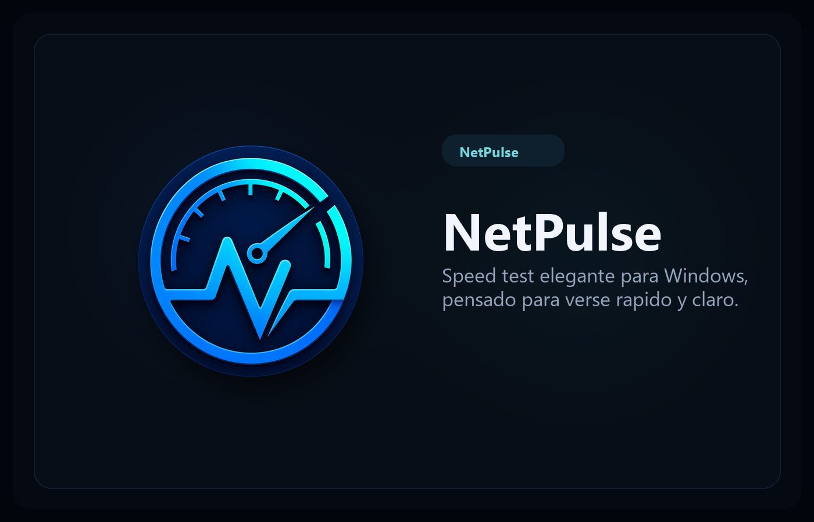
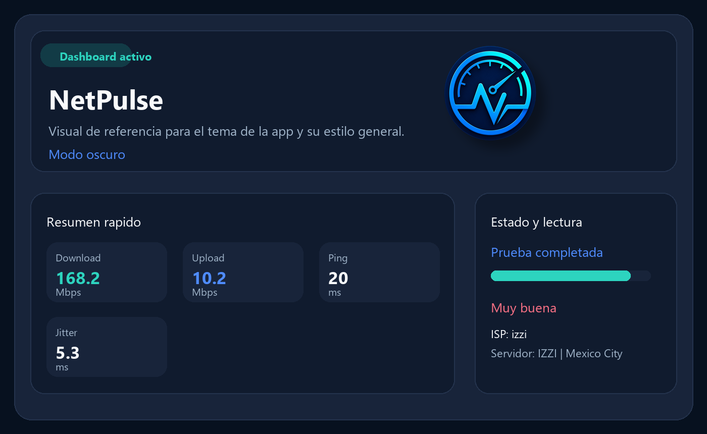
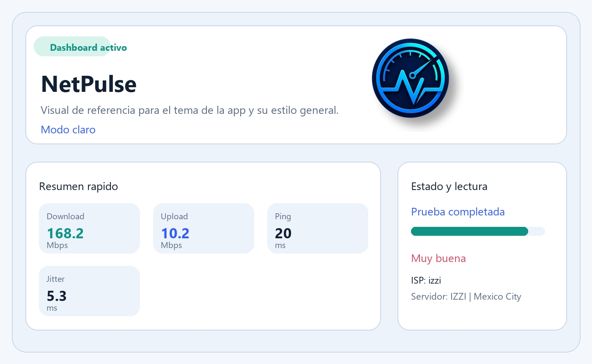

# NetPulse

Medidor de velocidad de internet para Windows con enfoque visual, moderno y listo para animaciones.



## Stack

- `C#`
- `WPF`
- `.NET 8`

## Visuales

### Modo oscuro



### Modo claro



## Objetivo del producto

NetPulse busca medir y presentar de forma amigable:

- `Ping`
- `Jitter`
- `Download`
- `Upload`
- historial local de resultados
- indicadores visuales de calidad de red

## Funcionalidades

| Area | Incluye |
| --- | --- |
| Medicion real | `Ping`, `jitter`, `download` y `upload` usando `Ookla Speedtest CLI` |
| UI | tema oscuro y claro, tarjetas animadas y barra de progreso visual |
| Historial | persistencia local, resumen rapido y limpieza de historial |
| Branding | logo, icono de Windows y assets para presentacion del proyecto |
| Release | scripts para preview, release firmado localmente y zip listo para descargar |

## Estado actual

- carpeta del proyecto separada del resto
- solucion `NetPulse.sln` creada
- app WPF `NetPulse.App` compilando sin errores
- dashboard interactivo en tema oscuro
- prueba real integrada con `Ookla Speedtest CLI`
- historial visual local persistente
- capas separadas en `Models`, `Services` y `ViewModels`
- servicio desacoplado para usar la CLI oficial de Ookla
- tema claro y oscuro con persistencia
- preview y release firmables localmente para equipos con `Smart App Control`
- logo e icono integrados en la app y en el ejecutable

## Estructura

```text
NetPulse/
  NetPulse.App/
    Converters/
    Assets/
    Models/
    Services/
    ViewModels/
    App.xaml
    MainWindow.xaml
  run-preview.ps1
  publish-release.ps1
```

## Uso rapido

## Descargas

- Repositorio: `https://github.com/Magicjg/NetPulse`
- Release Windows x64: usa la seccion `Releases` del repo para bajar `NetPulse-win-x64.zip`

### Preview local

```powershell
powershell -ExecutionPolicy Bypass -File .\run-preview.ps1
```

Esto publica la app en `%LOCALAPPDATA%\NetPulsePreview`, crea o reutiliza un certificado local `CN=NetPulse Local Dev`, firma los binarios y abre `NetPulse.App.exe`.

### Release local

```powershell
powershell -ExecutionPolicy Bypass -File .\publish-release.ps1
```

Esto genera un release en `dist\NetPulse-win-x64` y firma el ejecutable para esta misma maquina.
Tambien crea `dist\NetPulse-win-x64.zip` listo para mover o respaldar.

## Nota sobre la firma

- La maquina tiene `Smart App Control / Code Integrity` activo.
- Un `exe` sin firma es bloqueado aunque el proyecto compile bien.
- La firma local resuelve el uso en esta PC porque agrega un certificado de desarrollo a `CurrentUser`.
- Para distribuir la app a otras PCs sin friccion hace falta un certificado de firma de codigo confiable o una politica del equipo que permita la app.

## Siguiente fase

1. mejorar las transiciones de entrada de tarjetas e historial
2. agregar exportacion de resultados
3. ofrecer selector de servidor y mas telemetria real
4. preparar empaquetado de distribucion con firma de codigo real
